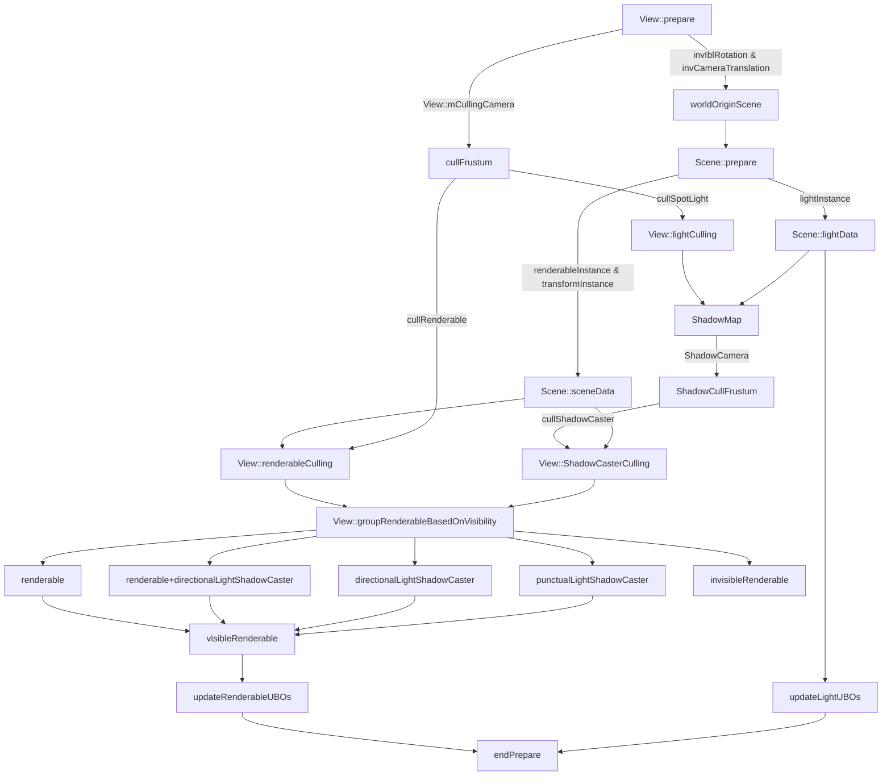

## Prepare

```mermaid
graph TD;
    View::prepare-->|View::mCullingCamera|cullFrustum;
    View::prepare-->|invIblRotation & invCameraTranslation|worldOriginScene;
    worldOriginScene-->Scene::prepare
    Scene::prepare-->|renderableInstance & transformInstance|Scene::sceneData;
    Scene::prepare-->|lightInstance|Scene::lightData;
    cullFrustum-->|cullSpotLight|View::lightCulling;
    Scene::sceneData-->View::renderableCulling;
    cullFrustum-->|cullRenderable|View::renderableCulling;
    View::lightCulling-->ShadowMap;
    Scene::lightData-->ShadowMap;
    ShadowMap-->|ShadowCamera|ShadowCullFrustum;
    ShadowCullFrustum-->|cullShadowCaster|View::ShadowCasterCulling;
    Scene::sceneData-->View::ShadowCasterCulling;
    View::renderableCulling-->View::groupRenderableBasedOnVisibility;
    View::ShadowCasterCulling-->View::groupRenderableBasedOnVisibility;
    View::groupRenderableBasedOnVisibility-->renderable;
    View::groupRenderableBasedOnVisibility-->renderable+directionalLightShadowCaster;
    View::groupRenderableBasedOnVisibility-->directionalLightShadowCaster;
    View::groupRenderableBasedOnVisibility-->punctualLightShadowCaster;
    View::groupRenderableBasedOnVisibility-->invisibleRenderable;
    renderable-->visibleRenderable;
    renderable+directionalLightShadowCaster-->visibleRenderable;
    directionalLightShadowCaster-->visibleRenderable;
    punctualLightShadowCaster-->visibleRenderable;
    visibleRenderable-->updateRenderableUBOs;
    updateRenderableUBOs-->endPrepare
    Scene::lightData-->updateLightUBOs
    updateLightUBOs-->endPrepare
```
